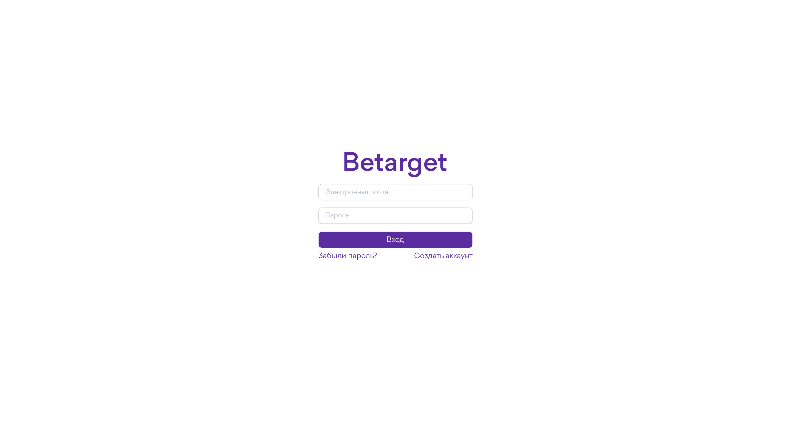
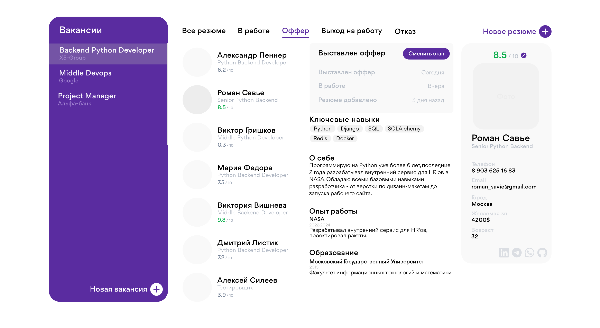

## Облачная CRM для автоматизации найма и ведения базы кандидатов

### Backend:
- **API** - [FastAPI](https://fastapi.tiangolo.com).
- **ORM** - [SQLAlchemy](https://www.sqlalchemy.org).
- **База данных** - [PostgreSQL](https://www.postgresql.org).
- **Валидация данных** - [Pydantic](https://docs.pydantic.dev).

### Frontend:
- HTML, CSS, SCSS, JavaScript, Vue (в будущем)

### Дополнительно:
- 🐳 [Docker Compose](https://www.docker.com).
- ✅ **Тесты** - [Pytest](https://pytest.org).
- 🔐 **Безопасное хеширование паролей** по умолчанию.
- 🔑 Аутентификация через **JWT** (JSON Web Token).
- 📫 Восстановление пароля через **email**.

### Сущности в проекте:
- Пользователь (User)
- Вакансия (Vacancy)
- Резюме (Resume)
- Клиент (тот, кто заказывает подбор специалистов). (ожидается 20.06.2024 - 1.07.2024)
- ...

### История проекта/дорожная карта:
- ✅ Инициализация проекта - 30.04.2024
- ✅ Добавление аутентификации | Добавление сущностей пользователя, резюме и вакансии - 02.05.2024
- .... 02.05.2024-29.05.2024 - множество изменений, история начинается здесь.
- ✅ Привет, Frontend 🌻 - 30.05.2024
- ✅ Добавление тестов - 12.06.2024
- --- ✅ Аутентификация
- --- ✅ Вакансии _в процессе_
- --- Резюме _в процессе_
- ✅ Добавление Docker - 14.06.2024
- Проект **v0.1.0** - первая рабочая версия: готовы страницы регистрации, входа и CRM - (ожидается 1.07.2024 - 30.07.2024)
- Сущность Клиент. (ожидается 1.07.2024 - 30.07.2024) (будет в проекте **v0.1.0**)
- Добавление GitHub Action для автоматизированных тестов. (будет в проекте **v0.1.0**)
- Отправка писем из CRM. (будет в проекте **v0.2.0**)
- Отправка сообщений из CRM в: Telegram, WhatsApp и т.д. (будет в проекте **v0.2.0**)
- Получение данных с сайтов поиска работы. (будет в проекте **v0.2.0**)
- Английская версия. (будет в проекте **v0.2.0**)
- Интеграция с сайтами поиска работы. (будет в проекте **v0.3.0**)
- Расширение для браузеров (будет в проекте **v0.4.0**-**v0.5.0**)

### Доступные маршруты:
- **Маршруты аутентификации:**
  - `GET /auth/ask_verification` - Запрос верификации
  - `GET /auth/verify-account` - Верификация пользователя
  - `POST /auth/forgot-password` - Сброс забытого пароля
  - `POST /auth/reset-password` - Сброс пароля
  - `POST /auth/login` - Вход через JWT
  - `POST /auth/logout` - Выход через JWT
  - `POST /auth/register` - Регистрация
  - `GET /auth/google/authorize` - OAuth авторизация через Google JWT
  - `GET /auth/google/callback` - OAuth обратный вызов Google JWT

- **Маршруты пользователя:**
  - `PUT /api/v1/user/` - Обновление пользователя
  - `DELETE /api/v1/user/` - Удаление пользователя
  - `PUT /api/v1/user/update_profile_image` - Обновление изображения профиля пользователя
  - `GET /api/v1/user/is_exists` - Проверка существования пользователя
  - `GET /api/v1/user/my_data` - Получение моих данных

- **Маршруты вакансий:**
  - `GET /api/v1/vacancy/` - Чтение вакансий пользователя
  - `PUT /api/v1/vacancy/` - Обновление вакансии пользователя
  - `POST /api/v1/vacancy/` - Создание вакансии пользователя
  - `GET /api/v1/vacancy/{vacancy_id}` - Чтение вакансии по ID
  - `DELETE /api/v1/vacancy/{vacancy_id}` - Удаление вакансии

- **Маршруты резюме:**
  - `GET /api/v1/resume/` - Получение резюме пользователя
  - `POST /api/v1/resume/` - Создание резюме пользователя
  - `PUT /api/v1/resume/` - Обновление резюме пользователя
  - `GET /api/v1/resume/{resume_id}` - Получение резюме по ID
  - `DELETE /api/v1/resume/{resume_id}` - Удаление резюме

- **Маршруты SSE:**
  - `GET /api/v1/sse/events` - Поток событий

### Страница входа (LOGIN)

*будет в проекте v0.1.0

### Страница CRM

*будет в проекте v0.1.0
